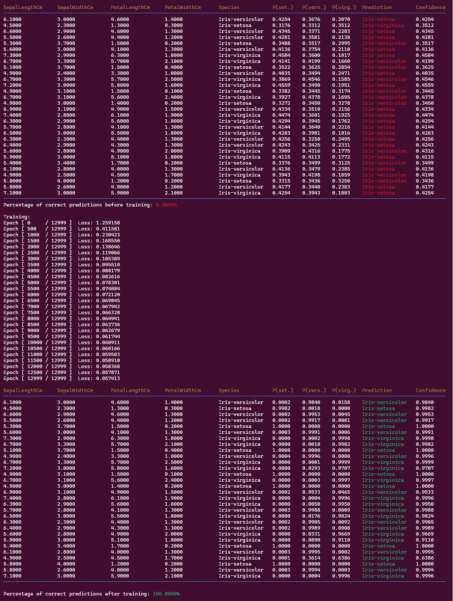
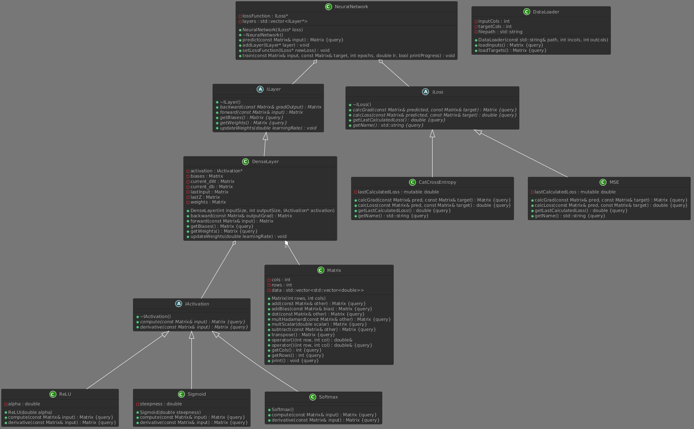

# CLFNN


`

**C++ Library for Feedforward Neural Networks**

CLFNN is a object-oriented, comprehensive multilayer perceptron library built completely from scratch. It relies solely on C++ standard library, featuring its own custom-built mathematical engine. It provides functionalities such as:
* loading data
* building custom dense layers
* training neural networks using gradient-descent with backpropagation
* applying trained model for both classification and regression tasks

## Table of Contents

- [Features](#features)
- [Requirements](#requirements)
- [Installation](#installation)
- [Usage](#usage)
- [Example: Iris Classification](#example-iris-classification)
- [Architecture](#architecture)
- [License](#license)

## Features

- **Custom Matrix Engine**
  - Cache-optimized matrix operations.
  - Supports fundamental algebraic operations, transpositions, and Hadamard products.
- **Strictly Object-Oriented Design**
  - Seamless modularity via `ILayer`, `ILoss`, and `IActivation` interfaces.
- **Layers and Activations**
  - Fully configurable Dense Layers.
  - Available activation functions: `ReLU`, `Sigmoid`, `Softmax`.
- **Optimization and Loss**
  - Built-in error calculations for `MSE` (Mean Squared Error) and `CCE` (Categorical Cross-Entropy).
  - Full backpropagation algorithm with early stopping mechanisms.

## Requirements

- **C++ Compiler**: Version supporting C++17 or newer (e.g., GCC 8+, Clang 5+, MSVC 19.15+).
- **Python** (Optional): For running data preprocessing script and Jupyter notebook.

## Installation

To install the library, simply clone the repository to your local machine.
```bash
git clone https://github.com/BartekBv/clfnn.git
cd clfnn
```

## Usage

### Include the header file
```C++
#include "clfnn.h"
```

### Compile your program
```bash
g++ -O3 your_main.cpp src/*.cpp -I include -o your_executable
```

### Example Code
Example of loading data, building network, training model and applying it for prediction
```C++
#include "clfnn.h"

int main() {
    // Initialize the loss function along with neural net and create custom layers.
    //Then load data using built-in DataLoader, train the model and apply it.
    ILoss* cce = new CatCrossEntropy();
    NeuralNetwork nn(cce);

    nn.addLayer(new DenseLayer(4, 8, new ReLU()));
    nn.addLayer(new DenseLayer(8, 3, new Softmax()));

    DataLoader loader("data/iris.csv", 4, 3);
    Matrix X_train = loader.loadInputs();
    Matrix Y_train = loader.loadTargets();

    int epochs = 15000;
    double learning_rate = 0.1;
    bool print_progress = true;
    nn.train(X_train, Y_train, epochs, learning_rate, print_progress);

    Matrix predictions = nn.predict(X_train);

    return 0;
}
```

## Example: Iris Classification
This repository includes classification example located in the `examples/` directory, built around the [Iris Species dataset](https://www.kaggle.com/datasets/uciml/iris). The program evaluates the model with random initial weights, executes the training process over 13,000 epochs, and re-evaluates the predictions to demonstrate model's accuracy improvement

### Data Preprocessing
The `Iris.csv` dataset was preprocessed using the Python scrips located in the `examples/data/` folder (`one_hot_iris.py`). Mentioned script applies One-Hot Encoding to target labels and splits the data into training and testing subsets.

### Compiling and Running the Demo
To execute the example directly from project's root direcotry, run:
```bash
g++ -O3 examples/example.cpp src/*.cpp -I include -o example_exec
./example_exec
```
### Output




## Architecture

Library is built on Object-oriented programming principles. Such architecture achieves high modularity and maintainability.

### SOLID
* Single Responsibility: Classes have strictly bounded scopes (`Matrix` isolates linear algebra, `DataLoader` handles pure file I/O).
* Open/Closed Principle: Custom layers (e.g. `DropoutLayer`) or loss functions can be injected without altering the `NeuralNetwork`.
* Liskov Substitution Principle: Polymorphic design ensures subclasses (`ReLU`, `CatCrossEntropy`) can replace their abstract interfaces (`IActivation`, `ILoss`).
* Interface Segregation Principle: Interfaces are kept minimal. `ILayer` forces only the essential methods (`forward`, `backward`, `updateWeights`), preventing other classes for implementing unused methods.
* Dependency Inversion Principle: The `NeuralNetwork` class does not instantiate its own layers or loss functions. Instead, it depends entirely on abstractions (`ILayer`, `ILoss`) injected via its constructor and methods, separating training loop from mathematical implementations.



### Performance
* Parsing: The `DataLoader` abandons standard string streams. It utilizes C++17 `std::string_view` and low-level `<charconv>` (`std::from_chars`) to parse CSV datasets directly from memory buffers.


## License

This project is licensed under the MIT License. See the [LICENSE](LICENSE) file for details.
